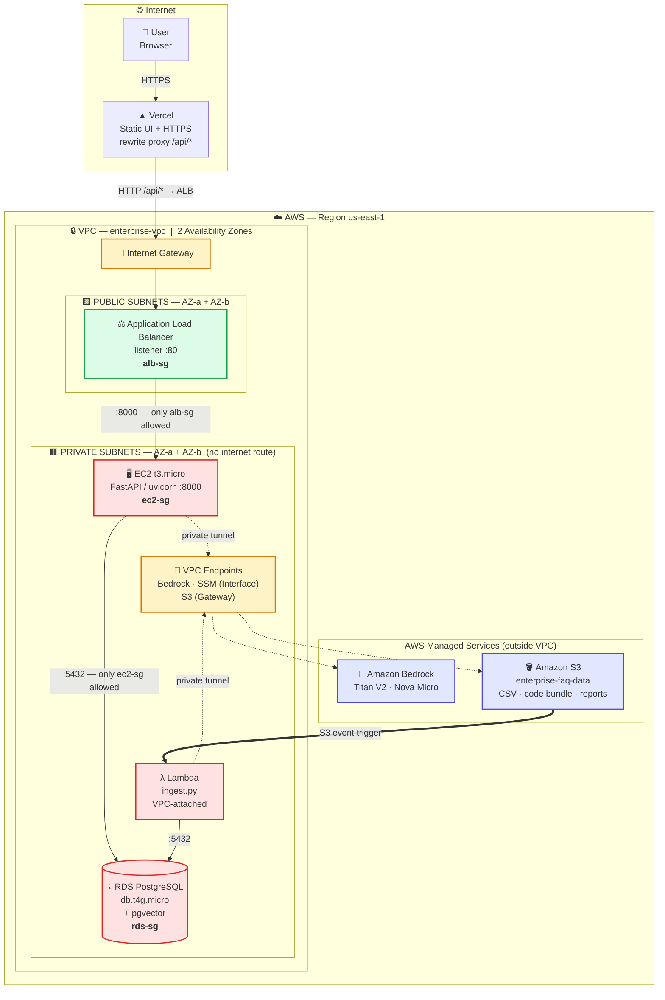
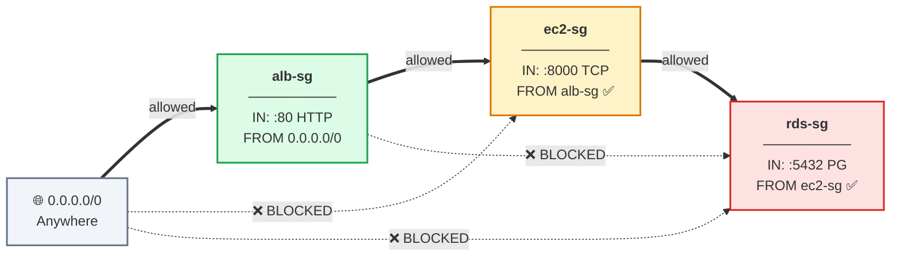
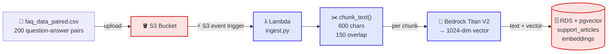
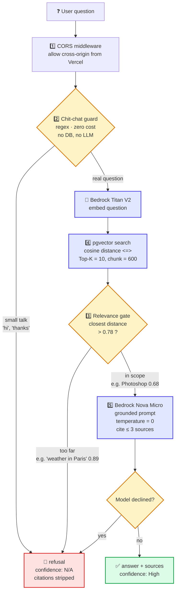
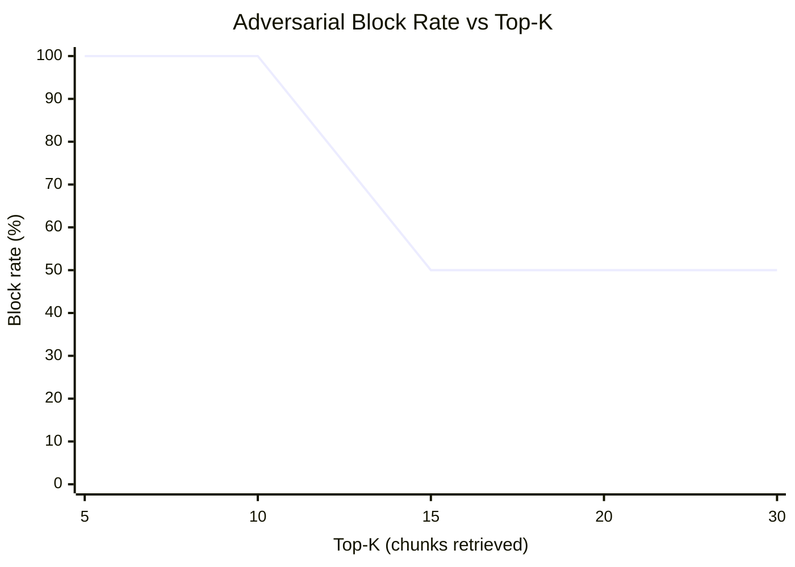
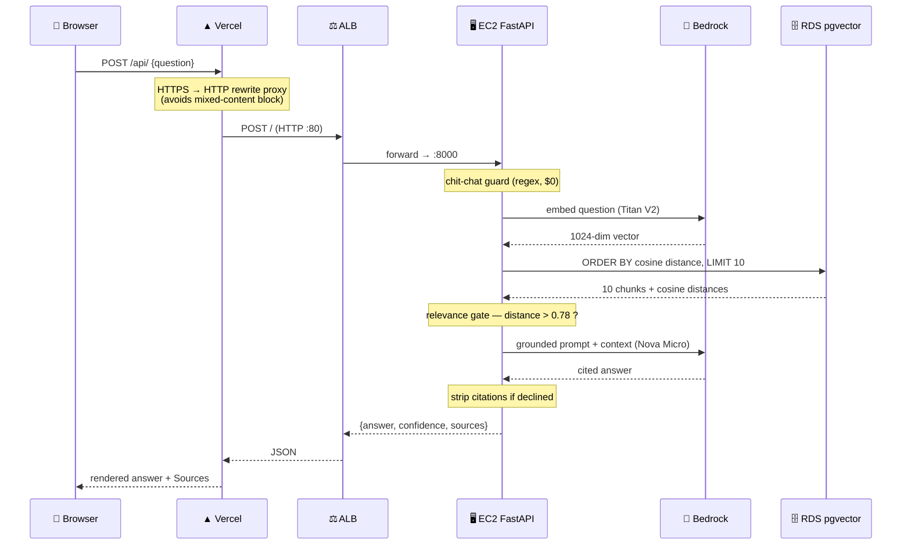

# 🏗️ Architecture — Smart Help Desk

Infrastructure diagrams for the AWS RAG chatbot: what lives in which subnet, how traffic flows, and why each boundary exists.

All diagrams below are [Mermaid](https://mermaid.js.org/) and render automatically on GitHub.

---

## 1. Infrastructure Overview — VPC & Subnet Placement

The single most important property of this design: **nothing that holds data or runs application logic is reachable from the internet.** Only the load balancer lives in a public subnet.

### Placement rationale

| Component | Subnet | Why there |
| :--- | :--- | :--- |
| **Application Load Balancer** | 🟩 Public | Must accept traffic from the internet. Requires 2 AZs by design |
| **EC2 (FastAPI API)** | 🟥 Private | No public IP — reachable *only* through the ALB. Admin access via SSM, not SSH |
| **Lambda (ingestion)** | 🟥 Private | Needs to reach RDS, which is private. VPC-attached |
| **RDS PostgreSQL** | 🟥 Private | Holds all data. `Publicly accessible = false`. Zero internet exposure |
| **VPC Endpoints** | 🟥 Private | Give private resources a route to Bedrock/S3/SSM **without** a NAT Gateway |

> 💡 **Cost decision:** the VPC was created with **NAT Gateways: NONE** (~$32/month saved). VPC Endpoints provide the private path to AWS services instead — traffic never leaves the AWS backbone, which is both cheaper *and* more secure.

---

## 2. Security Group Chain — Defense in Depth

Each tier trusts **only** the tier directly in front of it. Rules reference **security group IDs**, not IP addresses — so the chain survives instance replacement and is auto-scaling ready.

**What this buys:** the database cannot be reached from the internet, and it cannot even be reached from the load balancer — only from the application tier. That's the *Principle of Least Privilege* applied at the network layer.

---

## 3. Flow A — Ingestion Pipeline (offline, event-driven)

Runs when the corpus changes. Builds the searchable knowledge base.

**Why serverless here:** ingestion is bursty — it runs when data changes, then stops. Lambda costs nothing between runs.

---

## 4. Flow B — Live Query Pipeline (with guardrails)

Every question passes through **five layers**. Three of them can refuse *before* any model or database call is made.

### The three refusal paths — and why they're layered

| Layer | Mechanism | Cost to refuse | Catches |
| :--- | :--- | :--- | :--- |
| **Chit-chat guard** | Regex + keyword tiers | **$0** — no DB, no LLM | `"hi"`, `"thanks"`, `"are you a bot?"` |
| **Relevance gate** | pgvector cosine distance > 0.78 | 1 embed + 1 DB query, **no LLM** | `"What's the weather in Paris?"` |
| **Citation strip** | Server-side regex on the response | Full pipeline | Model declining despite retrieval |

> 🔑 **The design principle:** the relevance gate is **arithmetic, not a prompt instruction**. A prompt is a *request* the model may ignore; a distance threshold means the model **never executes**, so it *cannot* hallucinate a citation for an unrelated question. Safety is enforced in code, not trusted to the model.

---

## 5. The Top-K Safety Cliff

The finding that drove the production configuration. Retrieving **more** context made the system **less** safe.

| Top-K | Adversarial block rate | Interpretation |
| :---: | :---: | :--- |
| 5 | 100% ✅ | Safe, but thinner context |
| **10** | **100%** ✅ | **Production config — safe *and* complete** |
| 15 | 50% ❌ | Cliff edge — noise rationalised into answers |
| 20–30 | 50% ❌ | No recovery |

Past K=10 the extra chunks are mostly noise, but enough loosely-related text reaches the prompt that the model convinces itself it has grounds to answer. Production is locked at **chunk = 600, Top-K = 10**, which also cut p50 latency ~40% (1.00s → 0.60s).

---

## 6. Request Sequence — End to End

---

## 7. Service Inventory

| Service | Configuration | Role |
| :--- | :--- | :--- |
| **VPC** | 2 AZs · 2 public + 2 private subnets · no NAT Gateway | Network isolation |
| **ALB** | Public subnets · listener :80 → target :8000 · health check accepts 200 + 405 | Public entry point, health checks |
| **EC2** | `t3.micro` · private subnet · IAM: SSM + Bedrock | FastAPI query API |
| **Lambda** | Private subnet · S3 event trigger · IAM: S3 + Bedrock | Ingestion pipeline |
| **RDS** | `db.t4g.micro` · PostgreSQL + pgvector · Single-AZ · not publicly accessible | Text + 1024-dim vectors |
| **S3** | Bucket for CSV, code bundle, benchmark reports | Storage + event source |
| **Bedrock** | Titan Embeddings V2 · Nova Micro · Nova Lite | Embed · generate · evaluate |
| **VPC Endpoints** | Bedrock + SSM (Interface) · S3 (Gateway) | Private AWS access, no NAT |
| **SSM Session Manager** | Via Interface Endpoint | Admin shell — no SSH keys, no public IP |
| **IAM Roles** | `AmazonSSMManagedInstanceCore`, `AmazonBedrockFullAccess`, S3 read | Least-privilege, no static credentials |
| **Vercel** | Static hosting + `/api/*` rewrite to ALB | Frontend + HTTPS termination |

**Total running cost: under $5** — Free-Tier compute and database, no NAT Gateway, and right-sized models (Nova Micro rather than a frontier model for summarising short support snippets).

---

## 8. Design Decisions & Trade-offs

| Decision | Alternative considered | Why this choice |
| :--- | :--- | :--- |
| **pgvector inside RDS** | Pinecone / OpenSearch | One Free-Tier database stores text *and* vectors — no extra service, cost, or system to secure |
| **EC2 for the API** | Lambda behind API Gateway | Avoids cold starts + VPC ENI attach latency on every live query |
| **Lambda for ingestion** | Always-on worker | Ingestion is bursty and event-driven; costs nothing between runs |
| **VPC Endpoints** | NAT Gateway | Saves ~$32/month and keeps traffic on the AWS backbone |
| **ALB for one instance** | Public IP on EC2 | Keeps EC2 private, adds health checks, horizontally scalable from day one |
| **Vercel rewrite proxy** | ACM cert + custom domain on ALB | No domain purchase needed; solves HTTPS→HTTP mixed content immediately |
| **Nova Micro** | Claude / larger frontier model | Right-sized: sub-second latency and minimal cost for short-snippet summarisation |
| **Two-table schema** | Single table | Keeping large text out of the vector table means the similarity scan reads less per row |

### Known limitations (deliberate scope boundaries)

- **Stateless** — no conversation memory; each question is independent
- **Semantic search only** — no BM25/hybrid layer, so exact identifiers (SKUs, error codes) are a weak spot
- **Console-provisioned** — not yet Infrastructure as Code (Terraform/CDK is the next step)
- **Single-AZ RDS** — Free Tier constraint; production would be Multi-AZ
- **Threshold hand-calibrated** — 0.78 was tuned on a small sample and would need re-tuning on a larger corpus

---

*Diagrams use Mermaid and render natively on GitHub. Resource names are illustrative; no live endpoints or credentials appear in this repository.*
