# 🎧 Smart Help Desk — AWS RAG-Powered Chatbot

A production-style **retrieval-augmented generation (RAG)** customer-support chatbot built entirely on AWS. A user asks a question in the web UI; the system embeds it, retrieves the most relevant support responses from a Postgres/pgvector knowledge base, and has Amazon Bedrock generate a **cited, grounded answer**.

**Core stack:** FastAPI · Amazon Bedrock (Titan V2 + Nova Micro) · PostgreSQL/pgvector · AWS RDS · EC2 · ALB · S3 · Vercel

---

## 🏗️ Architecture

```
Browser (Vercel frontend)
        │  POST /api/  (HTTPS → reverse-proxied)
        ▼
AWS Application Load Balancer (ALB)
        │
        ▼
EC2 instance — FastAPI (uvicorn) on port 8000
        │
        ├──▶ Amazon Bedrock (Titan V2) → embed question into 1024-dim vector
        ├──▶ PostgreSQL / RDS + pgvector → cosine-distance search
        └──▶ Amazon Bedrock (Nova Micro) → generate cited answer from retrieved context
```

- **Frontend** — a self-contained `index.html` served from Vercel, which reverse-proxies `/api/` to the HTTP ALB (resolves browser mixed-content blocking).
- **Backend** — a FastAPI app (`query.py`) running on EC2. It turns the question into a vector, searches the DB, and asks Nova Micro to answer **only from the retrieved context**, with numbered citations.
- **Data pipeline** — `prepare_data_paired.py` reads the raw Kaggle CSV, `ingest.py` (Lambda) chunks + embeds + stores the corpus, `schema.sql` defines the pgvector tables.

> 📐 **Full infrastructure diagrams:** [`ARCHITECTURE.md`](ARCHITECTURE.md) (renders inline on GitHub) or [`ARCHITECTURE.html`](ARCHITECTURE.html) (styled dark-theme version — download and open in a browser). Both cover the VPC layout, public/private subnet placement, security-group chain, and both data flows.
>
> 🎬 **Visual walkthrough:** [`FLOWCHARTS.html`](FLOWCHARTS.html) (open in a browser — the Mermaid diagrams render client-side) or [`FLOWCHARTS.pdf`](FLOWCHARTS.pdf). Covers the ingestion and query pipelines, the tuning lab, the hybrid VPC view, the sequence flash cards, and the key numbers.
>
> 🎥 **5-minute video walkthrough:** [Loom](https://www.loom.com/share/3e1fcb3a57744b56b03fe09f1329674f) — the problem, the live demo (grounded answer + the Paris refusal), the Top-K finding, and a short AWS console tour. Screenshots from the same deployment are [below](#-screenshots).

---

## 🚀 Running Locally

### Prerequisites
- PostgreSQL with the `vector` extension (pgvector)
- AWS credentials (`AWS_ACCESS_KEY_ID` / `AWS_SECRET_ACCESS_KEY`) with Bedrock access
- Python 3.9+

### Steps
```bash
# 1. Set up the database (run schema.sql)
psql "$DATABASE_URL" -f schema.sql

# 2. Ingest the sample data
python ingest.py                # chunks, embeds, and stores in pgvector

# 3. Set DB env vars, then start the server
export DB_HOST="localhost"      # or your RDS endpoint
export DB_PASS="your-password"
uvicorn query:app --host 0.0.0.0 --port 8000

# 4. Test
curl -X POST http://localhost:8000/ \
  -H "Content-Type: application/json" \
  -d '{"question": "How do I reset my Photoshop preferences?"}'
```

### Optional: run the guard tests (no AWS/DB needed)
```bash
python test_guard.py
```

---

## 🧠 The Engineering Story (why this is interesting)

This project is deliberately built around **one key insight**: RAG quality is not just about "bigger model" or "more context" — it's about **controlling what the model is allowed to see and answer.**

### 1. The Top-K "Safety Cliff" 🔒
I ran a 10-experiment A/B sweep (chunk sizes 200–1000 × Top-K 5–30) and measured an **adversarial block rate** — how often the bot correctly refuses to answer an out-of-scope question.

| Top-K | Adversarial Block Rate |
|-------|------------------------|
| **K=10** | **100%** ✅ |
| K=15+  | **50%** ❌ |

Increasing Top-K past 10 didn't make answers better — it made them **less safe**. With 15+ chunks, the model starts pulling in unrelated context and **hallucinating answers to questions it shouldn't answer**. The production config is locked at **K=10, chunk=600** for this reason.

### 2. Deterministic Relevance Gate 🚦
Rather than relying on the LLM to "behave," I added a **deterministic gate using pgvector cosine distance**. If even the *closest* retrieved chunk is farther than a calibrated threshold (0.78), the system refuses with `confidence: "N/A"` **before** the LLM ever runs. The model can never hallucinate a citation for a totally unrelated question.

Calibrated on real demo questions:
- "Reset Photoshop preferences" → distance **0.68** (in-scope → answer)
- "Sprint direct message" → distance **0.34** (in-scope → answer)
- "What's the weather in Paris?" → distance **0.89** (out-of-scope → refuse)

**What a refusal actually looks like:** out-of-scope questions get a short, in-character refusal rather
than a dry "I can't help with that" — this build has a deliberately sassy persona. What matters is
*where* the refusal comes from: the gate returns it **before the LLM is ever invoked**, and the exact
line is chosen deterministically (`crc32(question) % N`), so the same question always gets the same
reply across restarts and recordings. No model decided to refuse anything.

### 3. Chit-Chat Guard (zero-cost) 💬
A pure regex/keyword pass intercepts greetings and small talk **before** any DB query or Bedrock call. Refusing "hi" costs zero tokens and zero latency — vector search would otherwise return its nearest neighbours for "hi" and the model would try to answer from irrelevant chunks. Intercepted small talk gets the same in-character refusal as the relevance gate.

### 4. Grounded, Cited Answers 📚
The generator (Nova Micro) is instructed to answer **only** from the provided context and cite at most **3** sources. Citations are **suppressed on refusals** — so an out-of-scope answer never leaks a bracket run like `[1][2][3]...`.

---

## 📸 Screenshots

Captured from the live deployment before teardown. Account identifiers are redacted; **resource IDs (VPC,
subnet, security group) are left visible on purpose — they are the evidence.** Narrated version:
[▶️ 5-minute Loom walkthrough](https://www.loom.com/share/3e1fcb3a57744b56b03fe09f1329674f).

### The chat experience

| Grounded answer | Out-of-scope refusal ⭐ | Chit-chat guard |
|---|---|---|
| 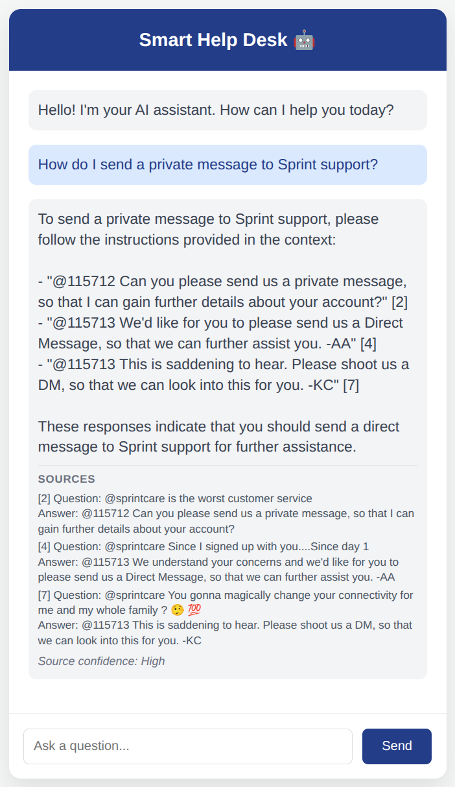 | 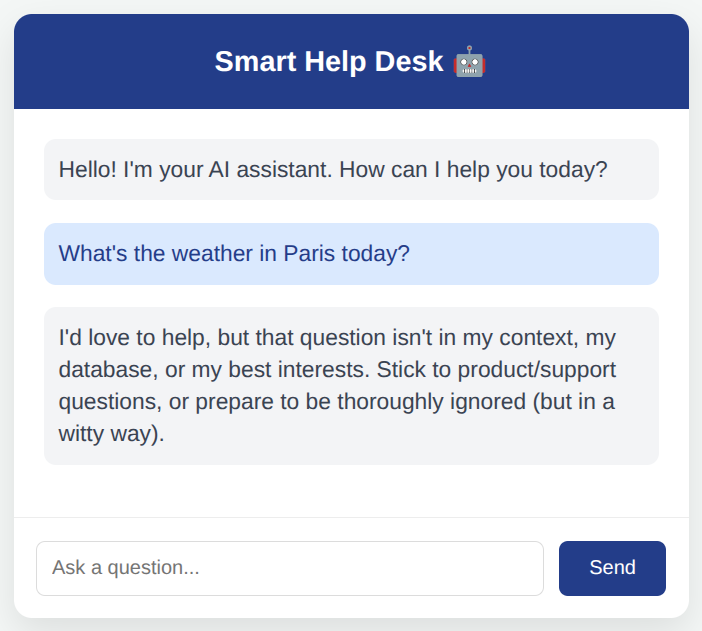 | 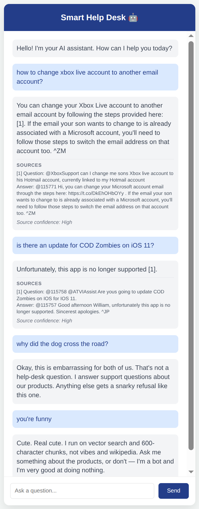 |
| Cited from retrieved context, capped at 3 sources | Cosine distance **0.89 > 0.78** → refused **before the LLM is called** | Regex intercept — no DB or Bedrock call, zero tokens |

### Data and compute

| 200 vectors in Postgres | ALB — the only internet-facing entry point |
|---|---|
| 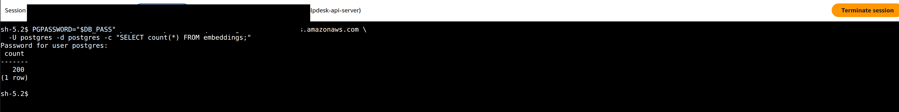 | 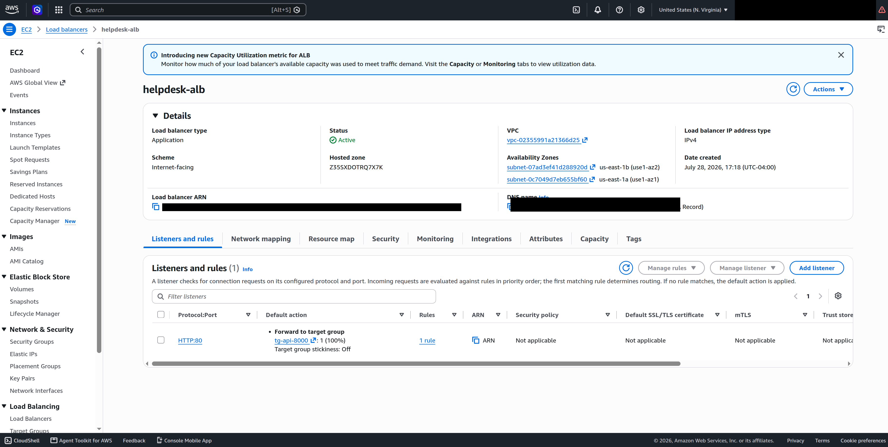 |
| `SELECT count(*) FROM embeddings;` → **200**, run over SSM Session Manager | Scheme **Internet-facing**, status **Active**, listener **HTTP:80** → `tg-api-8000` (100%) |

### Private networking

| VPC resource map | Private route table — the no-NAT proof |
|---|---|
| 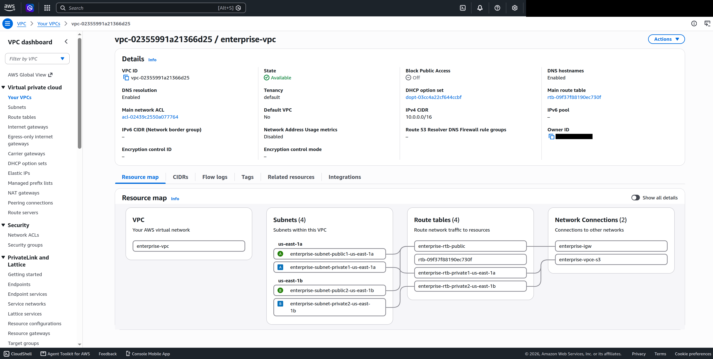 | 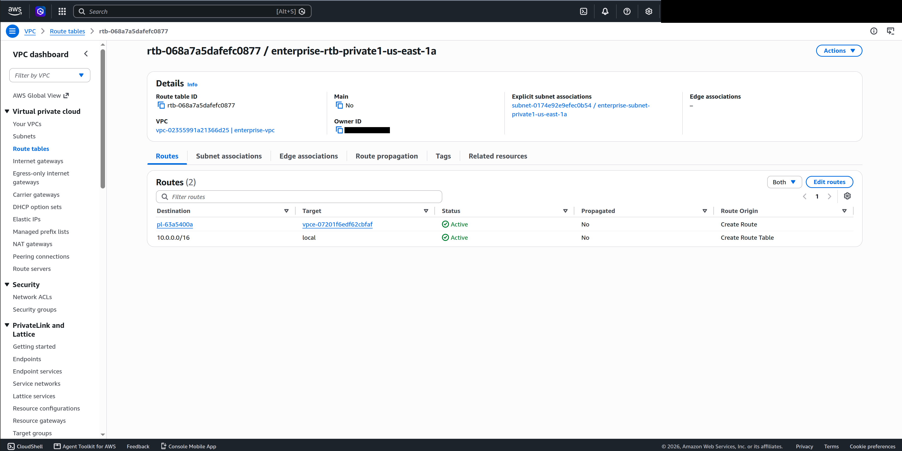 |
| Four subnets across two AZs, plus the IGW and the S3 gateway endpoint | Only the S3 prefix-list route and `local` — **no `0.0.0.0/0`**, hence no NAT Gateway (~$32/mo saved) |

| VPC endpoints | EC2 has no public address |
|---|---|
| 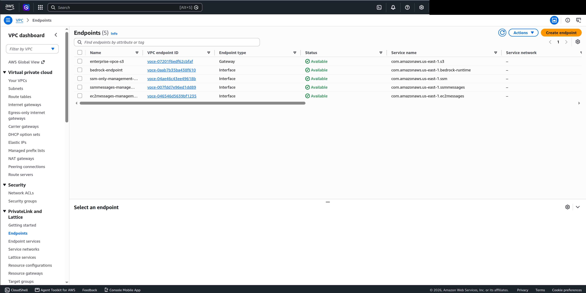 | 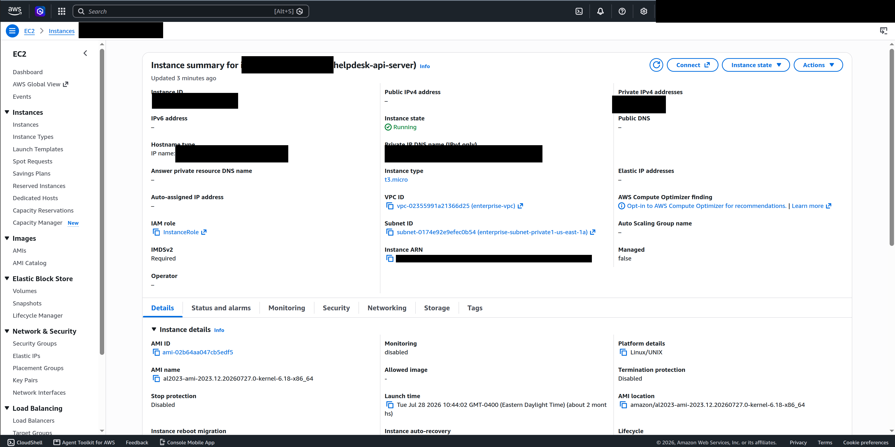 |
| S3 **Gateway** + Bedrock / SSM / SSMMessages / EC2Messages **Interface** | Public IPv4 `-`; private-1 subnet; attached to `ec2-sg` |

### The security-group chain

| `ec2-sg` inbound | `rds-sg` inbound | RDS is not reachable |
|---|---|---|
| 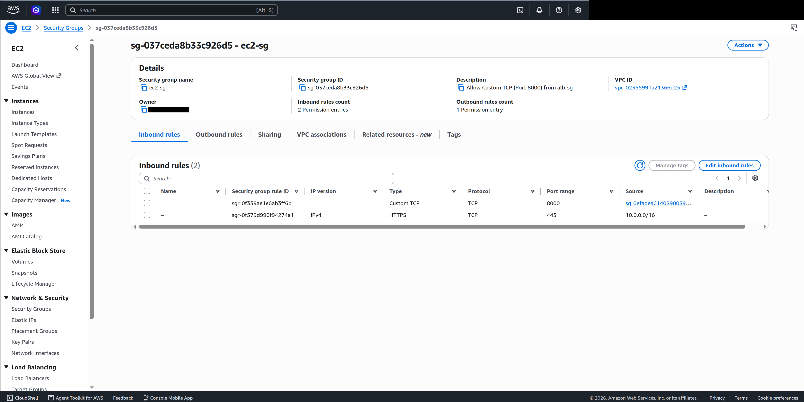 | 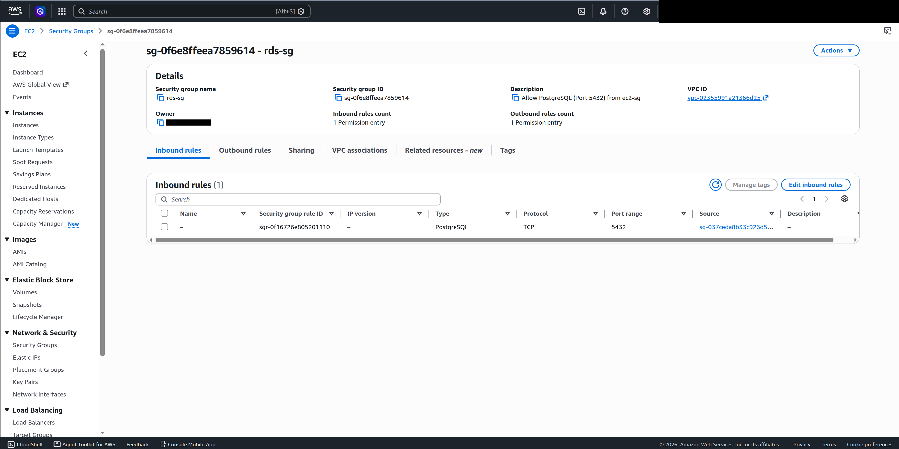 | 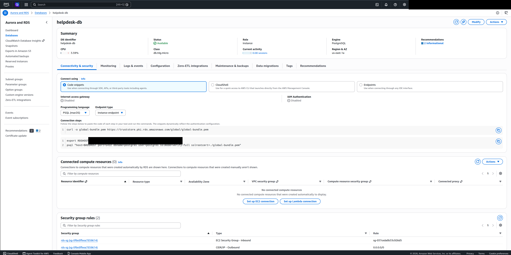 |
| `:8000` from `sg-0efadea6140890089…` (alb-sg), `:443` from the VPC CIDR for VPC-endpoint TLS | `:5432` from `sg-037ceda8b33c926d5` (ec2-sg) **only** — no `0.0.0.0/0` | `Internet access gateway: Disabled`, `db.t4g.micro` |

> **The chain:** `alb-sg (80)` → `ec2-sg (8000, source = alb-sg)` → `rds-sg (5432, source = ec2-sg)`.
> Every hop is enforced by a security-group *reference* rather than a CIDR, so no tier is reachable from
> the internet.

---

## 📁 File Reference

| File | Purpose |
|------|---------|
| `query.py` | FastAPI backend — the RAG query engine |
| `ingest.py` | Lambda ingestion pipeline (S3 trigger → chunk → embed → store) |
| `prepare_data_paired.py` | Builds the paired question+answer corpus (`faq_data_paired.csv`) from the raw Kaggle source |
| `schema.sql` | Postgres/pgvector table + index definitions |
| `setup_ec2.sh` | EC2 bootstrap + server startup |
| `test_guard.py` | Offline tests for the chit-chat guard |
| `index.html` | Self-contained frontend chat UI |
| `faq_data.csv` | **Processed sample corpus** (200 rows) — the small file that gets ingested |

---

## 📊 Dataset

This project uses the public **"Customer Support on Twitter"** dataset (originally from DeepMind, hosted on Kaggle). It contains millions of anonymized customer-support tweets from major brands.

**Note on the raw data:** the full `twcs.csv` is **~493MB** — far too large to commit to GitHub (the hard limit is 100MB per file). To work with the full dataset, download it directly from [Kaggle](https://www.kaggle.com/datasets/thoughtvector/customer-support-on-twitter) and run `prepare_data_paired.py` against it.

The repo ships with `faq_data.csv`, a **processed 200-row sample** (and `faq_data_paired.csv` is produced by `prepare_data_paired.py`), which is enough to run the system locally and demonstrate retrieval.

---

## 🔁 Models Used

| Role | Model |
|------|-------|
| Embedding | `amazon.titan-embed-text-v2:0` (1024-dim, normalized) |
| Generator | `amazon.nova-micro-v1:0` (fast, cheap, actively supported) |
| Judge (evaluation) | `amazon.nova-lite-v1:0` (LLM-as-a-judge for quality scoring) |

---

## 📈 Results & Metrics

- **Best config:** `chunk=600, Top-K=10` (chosen by LLM-as-a-judge, avg 12.0/15)
- **Adversarial block rate:** 100% at K=10
- **p50 latency:** ~0.6s
- **Grounding:** answers are cited from retrieved context; citations capped at 3 and suppressed on refusals

---

## 🏆 Key Takeaway

This isn't just "connect a vector DB to an LLM." It's a system where **safety and groundedness are engineered deterministically** — via a relevance gate, a chit-chat guard, and citation discipline — rather than trusted to the model. That's the difference between a demo and a deployable support bot.

---

*Built as part of an AWS capstone project. All credentials are read from environment variables; none are hardcoded.*
